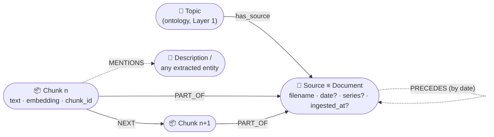
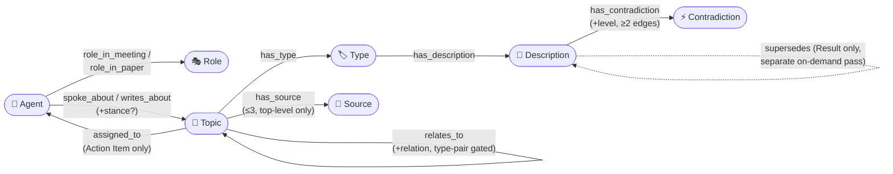
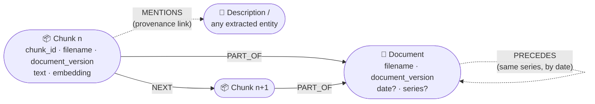
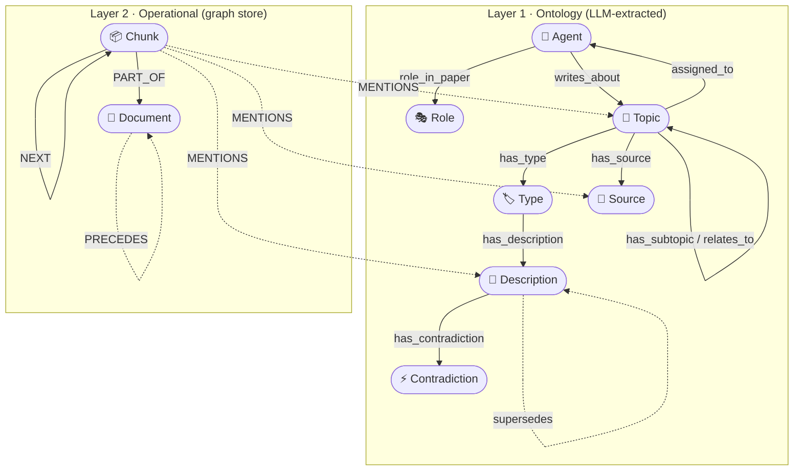

# Knowledge Graph Ontology — `knowledge-graph-builder` (v8.5)

> Disusun dari kode sumber di `Documents/knowledge-graph-builder`, bukan dari data instance
> di Neo4j. Ontology-nya memang **fixed di kode**, bukan sesuatu yang "muncul" dari isi
> graf — jadi dokumen ini mengonsolidasikan tiga sumber kebenaran yang sebelumnya tersebar
> (`src/graph/graph_model.py`, `src/prompts/graph_extractor.py`, `docs/conflict_ontology.md`)
> menjadi satu spesifikasi. Ditulis dalam Bahasa Inggris supaya konsisten dengan
> `README.md`/`docs/conflict_ontology.md` yang sudah ada di repo — kalau kamu mau versi
> Bahasa Indonesia, tinggal bilang.

**Source of truth (code, not this document):**

| Layer | File |
|---|---|
| Constants / enforcement (ground truth) | [`src/graph/graph_model.py`](../src/graph/graph_model.py) |
| Extraction contract given to the LLM | [`src/prompts/graph_extractor.py`](../src/prompts/graph_extractor.py) |
| Structural (non-LLM) relationships & post-processing | [`src/graph/knowledge_graph.py`](../src/graph/knowledge_graph.py) |
| Conflict sub-ontology detail | [`docs/conflict_ontology.md`](./conflict_ontology.md) |

If this document and the code ever disagree, the code wins — treat this as a snapshot
dated **2026-08-03**.

---

## 1. Design principle

The ontology is **closed and fixed**, not learned. An LLM (`GraphExtractor`) only decides
*which instances* to extract per chunk of text; it never decides *what the schema is*. A
deterministic function, `sanitize_graph`, re-enforces the schema afterward — fixing
relationship directions, renaming dynamically-named edges to their fixed form, dropping
anything off-ontology, capping cardinalities, and merging duplicate/near-duplicate nodes.
So the graph in Neo4j is guaranteed to conform to what's below, regardless of what the
extraction model actually emits.

Two extraction domains are supported by the **same** ontology and are disjoint by design:
academic **papers** and **meetings**. A single document can mix both (e.g. a supervision
meeting that discusses a paper's Method) — the `Type` a `Topic` is given tells you which
domain it belongs to.

**Two layers — don't conflate them.** This document describes two sets of nodes that share
one Neo4j database but answer different questions:

- **Layer 1 — the ontology (§2–§7):** the **7 node types the LLM extracts**. This is "the
  ontology" proper — the semantic schema of the knowledge itself. If all you want is the
  schema, you can stop at §7.
- **Layer 2 — the operational layer (§8):** `Chunk` / `Document` / `GraphMetric` nodes the
  graph store builds **deterministically, without the LLM**. They are *not* extracted and
  *not* part of the semantic schema — they're the substrate that makes the ontology usable:
  vector **retrieval**, **provenance** ("which passage / document / when"), and document
  **ordering**. They appear here because the `supersedes` / `Contradiction` provenance in §7
  lives on this layer, not on the 7 ontology nodes.

---

## 2. Node types (7, closed set — `ALLOWED_LABELS`)

| # | Label | What it represents | Required properties | Optional properties | Id format |
|---|---|---|---|---|---|
| 1 | **Agent** | A named person or organization that contributes to the document (author, speaker, supervisor, institution). Never a worker/robot/system/station/equation/table/figure. | `name` | — | Title Case name |
| 2 | **Role** | The function an Agent had in context (Author, Co-author, Supervisor, Speaker, Presenter, Moderator, Researcher…). | `name` | — | Title Case |
| 3 | **Topic** | Any concept, system, method, metric, problem, section, figure, table, or domain term. A subtopic is *not* a separate type — it's a normal Topic linked via `has_subtopic`. | `name` | `abbreviation`, `chapterNumber`, `tableNumber`, `figureNumber`; `status` and `priority` — **only** when the Topic's Type is `Action Item` | Title Case, no snake_case/ALL CAPS |
| 4 | **Type** | A semantic category classifying a Topic's function (see §4 vocabulary). Classifies — is not the content itself. | `name` | `domain` — auto-set deterministically to `paper` / `meeting` / `unknown` by `sanitize_graph` (§4) | exact casing from the closed vocabulary |
| 5 | **Source** | The uploaded file the information came from. Exactly one canonical Source node per document; all variants the model emits get collapsed into it. Today this is a **separate node** from the operational `Document` (§8a) that stands for the same file — see §8c/§8d for the proposed merge. | `name` | `format`, `date` | must equal the document's filename verbatim |
| 6 | **Description** | Why a specific Topic belongs to a specific Type. Min. 2 sentences, must contain ≥1 concrete detail (number, name, technical term, measured result) — tautological text ("X is a method") is rejected by the prompt. | `text`, `topicName`, `typeName`; `source_id` (added by `sanitize_graph`) | — | model emits `Description::<TopicName>::<TypeName>`; `sanitize_graph` rewrites it to `<CanonicalId>\|<CanonicalSource>` (v8.3 doc-scoping) |
| 7 | **Contradiction** | A reified conflict between ≥2 Descriptions that state incompatible facts. Not a Topic, not a Description — exists only to hold a summary and anchor ≥2 `has_contradiction` edges. Singleton Contradictions (only 1 edge) are removed downstream. | `summary` (≥2 sentences, must name the specific conflicting detail from both sides — "these disagree" alone is rejected) | — | `Contradiction <short label>` |

`sanitize_graph` also **drops** any node whose id equals its own label (placeholder
leakage), any `Description`/`Contradiction` with an empty required text field, and merges
bare-abbreviation nodes (via an `abbreviation` property) and near-duplicate `Topic`
strings (similarity ≥ 0.92) into one canonical node.

---

## 3. Relationships extracted from text (11, closed set — `_FIXED_RELATION_DIRS` + `has_*` pattern)

All relationship type names are fixed, lowercase, `snake_case` strings. Direction is
enforced — anything reversed, self-looping, or off this list is dropped.

| Relationship | Source → Target | Cardinality / constraint | Properties |
|---|---|---|---|
| `role_in_meeting` | Agent → Role | | — |
| `role_in_paper` | Agent → Role | | — |
| `spoke_about` | Agent → Topic | meeting context | optional `stance` ∈ {`raised`, `proposed`, `decided`, `reported`, `gave_feedback`} |
| `writes_about` | Agent → Topic | paper context | optional `stance` (same vocab) |
| `has_source` | Topic → Source | **only** the 1–3 top-level Topics per document; capped at 3 (`MAX_HAS_SOURCE`), cap tracked across the whole document, not per chunk | — |
| `has_type` | Topic → Type | fixed name — canonicalized from any `has_[type]` variant the model emits (e.g. `has_method`) | — |
| `has_description` | Type → Description | **never** Topic → Description or Agent → Description | — |
| `has_subtopic` | Topic → Topic | broader → narrower | — |
| `relates_to` | Topic → Topic | only kept if `relation` ∈ controlled vocab **and** endpoint Types match that relation's allowed pair (§5) | required `relation` |
| `assigned_to` | Topic → Agent | only kept if the source Topic has a validated `has_type` edge to `Action Item`; optional `due_date` goes on this edge, `status` goes on the Topic node instead | optional `due_date` |
| `has_contradiction` | Description → Contradiction | needs ≥2 such edges per Contradiction (enforced downstream, whole-graph pass) | required `level` ∈ {`direct`, `partial`, `apparent`} |

No self-loops anywhere (`source == target` is always dropped). Malformed relationship
names containing `::` or spaces are dropped rather than repaired.

---

## 4. Type vocabulary (closed, disjoint — `_PAPER_TYPES` / `_MEETING_TYPES`)

A `Topic`'s `Type` must come from exactly one of these two lists (never invented); casing
is exact. `sanitize_graph` tags every Type node with `domain` = `paper` / `meeting` /
`unknown` purely from this table — `unknown` only fires for a Type name the model invented
that matches neither list.

| Paper Types (14) | Meaning |
|---|---|
| Background | research background / context |
| Problem | problem the paper addresses |
| Research Goal | stated objective / aim |
| Theoretical Basis | underlying theory |
| Dataset | dataset / data used |
| Conclusion | concluding statement |
| Future Work | proposed future work |
| Existing Research | prior / related work |
| Research Gap | gap left by existing research |
| Method | method proposed by the paper |
| Experiment | what the experiment does |
| Result | result of the paper |
| Metrics Evaluation | metric / measure reported |
| Limitation | stated limitation |

| Meeting Types (26) | Meaning |
|---|---|
| **— discussion flow (v8)** | *what a segment of the meeting is* |
| Issue | problem/obstacle reported that triggers discussion |
| Idea | proposed solution, not yet agreed |
| Decision | final agreement on a direction/step |
| Action Item | concrete task following a Decision |
| Open Question | question raised, not yet resolved |
| Progress Update | status report since previous meeting |
| Feedback | input/critique from a supervisor/participant |
| Meeting Procedure *(v8.5)* | the mechanics of running the meeting rather than its content: audio/screen checks, greetings and closings, who presents next, scheduling, access to links. **Narrowest, last-resort Type** — see the caveats below |
| **— reasoning (v8.4)** | *what a segment asserts, and the reasoning around it* |
| Claim | a proposition that can be supported, contradicted, or qualified |
| Observation | a claim describing an observed cue, event, or state |
| Rationale | a reason that justifies a decision or action |
| Assumption | an unstated or stated premise used in reasoning |
| Heuristic | a practical rule used to guide judgement or action |
| Prediction | a claim about an expected future state or outcome |
| Option | a candidate action, tool, or approach considered in a decision |
| Evidence | material, observation, or experience offered in support of a claim |
| Constraint | a limitation that restricts a decision or action |
| Risk | a potential undesirable consequence relevant to a decision |
| Trade Off | a balance between competing benefits, costs, or values |
| Exception | a circumstance in which a normally applicable decision or rule does not apply |
| Uncertainty | an acknowledged limit to what is known or determined |
| Condition | a contextual state under which knowledge, an action, or a decision applies |
| Rule | a formal or informal norm governing an activity |
| Action | a goal-directed act performed within an activity |
| Outcome | a result produced by an activity or action |
| Disagreement | a documented difference of position among relevant participants |

The two Meeting groups are one flat vocabulary, not two levels — the split is
editorial. A Topic still gets exactly one Type; the reasoning group just lets the
graph say *what was asserted* where before it could only say *that something was
discussed*. `sanitize_graph` treats all 25 identically (`domain = meeting`).

A single document may legitimately contain Topics typed from **both** lists (e.g. a
supervision meeting discussing a Method) — that's expected, not an error.

**`Meeting Procedure` (v8.5) — three things that make it work, all required:**

1. **A deterministic `has_source` ban.** A Topic whose *only* Type is
   `Meeting Procedure` has its `has_source` edge dropped by `sanitize_graph`
   *before* the `MAX_HAS_SOURCE` cap is consulted, so it never even consumes a
   slot. This is the point of the Type. That cap is first-come-first-served in
   chunk order (`has_source_state` spans the document), and a transcript's chunk 1
   is greetings and "can you hear me?" — left alone it fills all three
   "document core" slots before the first chunk of real content is reached. The
   ordering happens to work for papers, whose chunk 1 is the abstract; it inverts
   on meetings. A Topic typed `Meeting Procedure` **and** something contentful
   (e.g. `Decision`) is not procedural-only and keeps its claim on a slot.
2. **A relaxed `Description` rule.** One plain sentence, no required specific
   detail — the exception to §4's ≥2-sentences-with-a-concrete-detail rule.
   Without it the model fabricates a number or name to satisfy that rule, which
   is a worse failure than a short Description.
3. **Last-resort framing in the prompt.** A catch-all is an attractor for a small
   model, so it is defined as the narrowest Type and carries its own tie-breaker
   paragraph: if the text states any problem, plan, claim, result or critique
   about *the work itself*, it is not `Meeting Procedure`.

It is deliberately **not** in `ALLOWED_TYPES` for conflict detection — it carries
no assertion, so it can never be a conflict participant.

**Three consequences of the v8.4 expansion, all still open:**

1. **No `relates_to` support yet (§5).** None of the 18 reasoning Types appears in
   `RELATES_TO_TYPE_PAIRS`, so a Topic typed `Evidence` or `Risk` can only attach via
   `has_subtopic` — the pair table drops any `relates_to` touching it. The relations
   this vocabulary implies (`supports` Evidence → Claim, `justifies` Rationale →
   Decision, `qualifies` Condition → Claim, `considered_in` Option → Decision) do not
   exist yet.
2. **Not conflict participants yet.** `ALLOWED_TYPES` in
   [`src/conflict/config.py`](../src/conflict/config.py) is still
   `Result, Metrics Evaluation, Conclusion, Decision, Progress Update`. `Claim`,
   `Observation`, `Prediction` and `Outcome` are assertion-bearing by definition —
   arguably the *most* natural conflict participants — but adding them widens the
   candidate-pair space, so it's a deliberate separate decision (§7,
   [`docs/conflict_pipeline.md`](./conflict_pipeline.md)).
3. **Id-namespace collision risk.** `sanitize_graph` keys nodes by canonical id
   *across labels*, so a Topic literally named "Risk", "Evidence", "Rule" or "Action"
   collides with the Type node of the same name — the second one is dropped and its
   `has_type` edge becomes a self-loop. Rare with 7 concrete Meeting Types; more
   likely now that the vocabulary uses common abstract nouns.

---

## 5. `relates_to` relation vocabulary (12 values, type-pair constrained)

`relates_to` is the only relationship carrying a free-form-looking but actually
**closed and pair-constrained** property, `relation`. `sanitize_graph` drops the whole
edge unless both the `relation` string *and* the endpoint Types match the row below
(`RELATES_TO_TYPE_PAIRS`).

| `relation` | Source Type(s) | Target Type(s) | Meaning |
|---|---|---|---|
| `addresses` | Method | Problem, Research Goal | proposed method targets this problem/goal |
| `resolves` | Decision | Issue, Open Question | a decision settles the issue/question |
| `produces` | Decision | Action Item | a decision generates a task |
| `evaluates` | Experiment, Metrics Evaluation | Result | a measurement yields this result |
| `uses` | Method, Experiment | Dataset | method/experiment applied to this dataset |
| `motivates` | Background, Research Gap, Problem | Method, Research Goal | the reason this method/goal exists |
| `identifies` | Background, Existing Research | Research Gap | prior work reveals this gap |
| `extends` | Method | Existing Research, Theoretical Basis | builds on prior work/theory |
| `compares_to` | Result | Existing Research, Result | benchmarking / comparison |
| `contradicts` | Result, Feedback | Result, Idea, Decision | a direct conflict (Topic-level) |
| `responds_to` | Feedback | Idea, Decision, Progress Update, Method, Result, Limitation | non-conflicting feedback |
| `follows_up_on` | Progress Update | Progress Update, Action Item | a later update references an earlier one |

Note the boundary with §7: `contradicts` here is a **Topic/finding-level** conflict
signalled explicitly by the text; `has_contradiction` (§2/§7) is for a conflict only
visible when comparing the *specific detail* inside two Descriptions. The same single
conflict should not be encoded at both levels unless the text genuinely supports both.

---

## 6. Controlled property vocabularies

| Property | Allowed on | Values |
|---|---|---|
| `status` | Topic (only when Type = Action Item) | `open`, `in_progress`, `done`, `blocked` |
| `stance` | `spoke_about` / `writes_about` edges | `raised`, `proposed`, `decided`, `reported`, `gave_feedback` |
| `level` | `has_contradiction` edges | `direct`, `partial`, `apparent` |
| `domain` | Type nodes (auto-set) | `paper`, `meeting`, `unknown` |

Any value outside these sets is **dropped** (the property is removed, the node/edge is
kept) — except `relates_to`'s `relation`, where an invalid value drops the whole edge,
since an untyped `relates_to` carries no information.

---

## 7. Conflict sub-ontology: `Contradiction` and `supersedes`

Full spec: [`docs/conflict_ontology.md`](./conflict_ontology.md). Two axes matter and
shouldn't be conflated:

- **When it runs** — per-chunk construction *can* emit `Contradiction` nodes, but only
  catches conflicts visible within a single chunk. A **separate, on-demand pass** scans
  the *whole* graph afterward and is what actually catches cross-chunk / cross-document
  conflicts (and is the only place `supersedes` is ever produced).
- **What shape it writes** — the two possible outcomes below are the same regardless of
  which pass produces them.

| Situation | Output | Creates a node? |
|---|---|---|
| Two Result facts genuinely conflict and both still stand | `Contradiction` node + ≥2 `has_contradiction` edges (`Description → Contradiction`, each with `level`) | Yes |
| A newer Result corrects/replaces an older one | `supersedes` edge, `Description → Description`, direction **newer → older** | No — edge only |

**`supersedes` constraints** (enforced by the detection pass / a downstream whole-graph
query, not by the per-chunk `sanitize_graph`):

1. Both endpoints must be `Description` nodes with `typeName == "Result"`.
2. No self-loop.
3. **Anti-cycle**: `A supersedes B` and `B supersedes A` must never coexist — that
   situation is a `Contradiction`, not a supersession. Exactly one relationship per pair.
4. Optional `reason` property (why it's an update).

Decision rule used by the classifier:

```
conflict between two Result facts A (newer) and B (older):
  is A a correction/update of B, where B is now wrong?
    → yes:  (A)-[:supersedes {reason?}]->(B)          # edge only, no node
    → no (both still stand, genuinely opposed):
            create Contradiction{summary} +
            (A)-[:has_contradiction {level}]->(C) and
            (B)-[:has_contradiction {level}]->(C)      # reified node
```

**Deciding the direction ("newer → older").** Right now this is purely the classifier's
judgment — nothing in the graph *proves* which Result is newer. The objective signal
already exists one layer down: every `Description` is linked back to its originating
document, and that document's `date`, through the provenance chain in §8
(`Description ← MENTIONS ← Chunk → PART_OF → Document`). The on-demand pass can use
`Document.date` to **derive or verify** the direction instead of trusting the LLM — and
break ties deterministically once an ingestion timestamp exists (see §8c). The same chain
answers, for any `Contradiction`, **which document and when** each conflicting side came
from — the original reason to care about provenance here.

> Why not just wire `Source → Type` for this? Because `Type` nodes are **global
> singletons** — every document's "Result" is the *same* node (merged by canonical id),
> so a `Source → Type` edge fans every document into one shared Type and carries **no**
> per-document provenance. Provenance has to live on the per-chunk `MENTIONS` chain (§8),
> at the fact level, not on `Type`.

---

## 8. Operational / provenance layer (not LLM-extracted, added by the graph store)

Everything above is Layer 1 — the **extracted** ontology. Wrapped around it is Layer 2: a
set of nodes `KnowledgeGraph` builds deterministically, independent of the LLM. They exist
for three jobs the 7 ontology nodes can't do on their own:

- **Retrieval** — each text window carries an embedding + a vector index, so the source text
  is semantically searchable (RAG). Without it the graph is claims with no way to search the
  text behind them.
- **Provenance** — every extracted node links back to the exact passage and document it came
  from, so any fact can be cited ("says who, from where").
- **Time & order** — chunk sequence and document dates, so you can ask "what came before this
  Decision" and, crucially, ground the `supersedes` direction (§7).

This is where "**which document, and when**" actually lives — the provenance a `supersedes` /
`Contradiction` needs.

### 8a. Operational node types & their properties

| Label | Purpose | Properties |
|---|---|---|
| **Chunk** | one text window of a document; holds the vector used for retrieval | `text`, `embedding` (vector), `chunk_id` (int — drives `NEXT`), `filename`, `document_version`, `chunk_size`, `chunk_overlap`, `embeddings_model`; plus any copied doc metadata (`source_path`, `source_kind`, `n_chunks`) |
| **Document** | one ingested file; the anchor for provenance & time | `filename`, `document_version`; optional `date` (ISO 8601) and `series` — **required for `PRECEDES`**, but currently **not** set by `ChunksIngestor` (which only copies `source_path` / `source_kind` / `n_chunks`), so date-based features are opt-in until supplied |
| **GraphMetric** | singleton(s) holding graph-level metrics (Leiden / Louvain modularity) | `name` (e.g. `leiden_modularity`), `value` — **an isolated node with no edges** to anything; arguably shouldn't be a node at all (see §8d) |

> **`Source` and `Document` are two nodes for the same file.** The ontology `Source` node
> (§2, from extraction) and this `Document` node (from `_create_document_node`) both stand for
> the uploaded file — a genuine redundancy. `PRECEDES` and the provenance chain use the
> `Document` side. These two **should be merged into one node** holding all document-level
> metadata; see §8c (why) and §8d (proposed).

### 8b. Structural relationships

| Relationship | Source → Target | Trigger |
|---|---|---|
| `PART_OF` | Chunk → Document | every Chunk belonging to a Document |
| `NEXT` | Chunk → Chunk | `chunk_id` → `chunk_id + 1` within the same Document/version |
| `MENTIONS` | Chunk → (any extracted entity node) | chunk text mentions that entity — **the provenance link** |
| `PRECEDES` | Document → Document | **opt-in**; chains same-`series` Documents chronologically by `date` (ISO 8601, ascending) |

**Provenance chain.** For any extracted node — including the two Descriptions in a
`supersedes` edge, or the Descriptions under a `Contradiction`:

```
(Description) ←[:MENTIONS]— (Chunk {filename, document_version, chunk_id})
                              —[:PART_OF]→ (Document {date?, series?})
```

This is the path that answers "where did this fact come from, and when". `MENTIONS` is
many-to-one **on purpose**: a `Description` whose id (`Description::<Topic>::<Type>`) is
reused across documents merges into one node, but keeps one `MENTIONS` link per source
chunk — so cross-document provenance isn't lost to node merging.

Separately, an enrichment step (`graph_ds`) computes **PageRank**, **betweenness**, and
**closeness** centrality plus **Leiden** / **Louvain** communities, annotating existing
nodes with extra properties (`pagerank`, `betweenness`, `closeness`, `community_leiden`,
`community_louvain`) rather than adding new node/relationship types to the ontology.

### 8c. Modeling rationale — one node vs. many

A fair question: why not collapse this layer into properties on a single node (e.g. the
`Source`) and avoid node-to-node hops at retrieval time? The answer splits in two.

**Document-level facts → yes, one node.** `filename`, `date`, `series`, `ingested_at` are
**scalar, one value per document**. They belong as properties on a single node — and since
`Source` and `Document` already both represent the file, the right move is to **merge them**
(§8d), not to add more nodes.

**Passage-level data (`Chunk`) → must stay separate nodes.** This one cannot fold into the
document node:

- A document is split into **many** chunks, each with **its own embedding**. A Neo4j vector
  index holds **one vector per node** and returns nodes by similarity — so one node per
  document could store only one embedding, collapsing retrieval from **passage** granularity
  to **whole-document** granularity (and many vectors on one node isn't even indexable). RAG
  precision depends on retrieving the specific relevant passage.
- Provenance (`MENTIONS`) must point at the **specific passage** a fact came from; one node
  per document would erase that.

**On the "hops cost extra" intuition — it inverts in a native graph DB.** Following a
relationship in Neo4j is a cheap pointer-dereference, not a SQL-style join; a single
`Chunk → Document` hop is ~constant and is exactly what the engine is optimized for. The
*expensive* shape is a **fat node**: reading it loads **all** its properties, so a query that
only wants `filename` would drag every embedding blob along. Splitting keeps the small, hot
metadata apart from the heavy vectors — so it is the *more* efficient design, not less.
Retrieval also finds `Chunk` nodes **directly** from the vector index (no traversal), then
does at most one hop for context/provenance.

### 8d. Proposed (not yet in code)

Flagged here so the picture is complete; **none are in the code yet** — the tables in 8a/8b
remain the accurate snapshot.

| Proposal | Where | Why |
|---|---|---|
| **Merge `Source` + `Document`** into one node holding all document-level metadata | ontology `Source` (§2) ⊕ operational `Document` (§8a) | they represent the same file (§8c); removes the redundancy and gives one home for `filename` / `date` / `series` / `ingested_at`. `Chunk` stays separate. |
| `ingested_at` (system UTC timestamp) | new property on the merged doc node | reliable, LLM-independent; audit trail + deterministic tie-breaker for `supersedes` when two documents share the same `date` |
| Derive / verify `supersedes` direction from the doc node's `date` | on-demand conflict pass | replaces the LLM's "newer → older" guess with the reachable document date (§7) |
| `CREATE` → `MERGE` in `_create_document_node` (keyed on `filename` + `document_version`) | `KnowledgeGraph` | today re-ingesting a document creates **duplicate** `Document` nodes; must be idempotent before it's trusted for provenance |
| Reliably set `date` (and `series`) at ingestion | `ChunksIngestor` / caller metadata | without them neither `PRECEDES` nor date-based `supersedes` can fire; today they're absent from JSONL ingestion |
| Stop storing graph-level metrics as an isolated `GraphMetric` **node** | `graph_ds` / `update_modularity` | a whole-graph scalar (modularity) isn't an entity, and an edgeless node is a graph smell — it's the *only* thing that breaks "one connected graph" (§9). Put it on a property (a single root/config node, or app/metrics state). Per-node metrics (`pagerank`, community labels) are already node **properties** and are fine as-is. |

Proposed target shape — `Source ≡ Document` merged, `Chunk` kept separate. The merged node
also becomes the single point where **Layer 1** (`has_source` from a Topic) and **Layer 2**
(`PART_OF` from a Chunk) meet:



---

## 9. Diagrams (current state)

> These show what the code produces **today** (Source and Document still separate). For the
> cleaned-up target shape, see §8d.





> Provenance chain a `supersedes` / `Contradiction` uses to answer *which document & when*:
> `Description ← MENTIONS ← Chunk → PART_OF → Document.date`.

### The whole thing — one connected graph

The two diagrams above are the **same** graph seen from two altitudes. `MENTIONS`
(Chunk → any extracted entity) is the bridge that ties them together, so **every** ontology
node is reachable from its `Document` via `Chunk` — structurally it is a **single connected
component**, not two graphs. (`GraphMetric` is deliberately omitted: it has no edges to
anything — the one true island, which is exactly why §8d proposes it shouldn't be a node.)



> The dashed `MENTIONS` edges crossing from Layer 2 into Layer 1 are what make this one
> connected component. `Source` (Layer 1) and `Document` (Layer 2) both stand for the file
> but aren't linked directly today — §8d merges them into one node.

---

## 10. Enforcement summary — what `sanitize_graph` guarantees regardless of model output

- Exactly one canonical `Source` node per document (all variants merged into it).
- Every relationship direction matches §3's table; reversed/self-looping edges dropped.
- `has_[type]` / `has_[type]_description` variants canonicalized to fixed `has_type` /
  `has_description` — the "11 fixed relationship names" claim holds even when the model
  doesn't comply with the prompt.
- `relates_to` kept only with a valid `relation` **and** a matching endpoint-Type pair.
- `assigned_to` kept only when the source Topic is validly typed `Action Item`.
- `status` / `stance` / `level` values outside their controlled vocab are stripped (node
  or edge is kept, just the bad property is removed) — except `relates_to`'s `relation`,
  where a bad value drops the whole edge.
- Bare-abbreviation nodes and near-duplicate (≥0.92 similarity) `Topic` strings merged.
- Placeholder nodes (id == label) dropped; empty `Description`/`Contradiction` dropped.
- `has_source` capped at 3 edges per document (not per chunk).
- Singleton `Contradiction` nodes (only 1 `has_contradiction` edge) removed once the whole
  document is stored.

---

## 11. Version history (as documented in code)

| Version | Change |
|---|---|
| v7 | Prior ontology; had a "shared" Type bucket instead of disjoint Paper/Meeting vocabularies. |
| v8 | Disjoint 14-Paper/7-Meeting Type vocabulary; fixed `has_type`/`has_description` names; type-pair-constrained `relates_to`; added `uses`/`extends`/`compares_to`; `stance` on `spoke_about`/`writes_about`; `status` on Action Item Topics; `date` on Source. |
| v8.1 | Added `Contradiction` node type + `has_contradiction` edge (per-chunk, single-chunk visibility only). |
| v8.2 | Added `supersedes` edge (on-demand, whole-graph pass only) — see §7. |
| v8.3 | `Description` ids scoped per source document (`…\|<CanonicalSource>` + a `source_id` property), so two documents describing the same Topic+Type no longer MERGE into one node — a precondition for cross-document conflict detection. |
| v8.5 | Added Meeting Type `Meeting Procedure` (26th) for talk that runs the meeting rather than carrying its content, plus the deterministic `has_source` ban that stops a transcript's opening audio-check from claiming the document's core-Topic slots. Also doc-level `date`, `series` and `doc_type` now reach the `Document` node from producer metadata (see [`docs/chunk_schema.md`](./chunk_schema.md)), which is what `PRECEDES` chains a recurring meeting by and what promotes `Source.year` for the supersession pass. |
| v8.4 | Meeting Type vocabulary 7 → 25: added an argumentation/reasoning layer (Claim, Observation, Rationale, Assumption, Heuristic, Prediction, Option, Evidence, Constraint, Risk, Trade Off, Exception, Uncertainty, Condition, Rule, Action, Outcome, Disagreement). Vocabulary only — no new node type, no new relationship, and `relates_to`'s pair table (§5) is unchanged. |

---

*Generated 2026-07-29 by reading the repo's own schema-enforcement code rather than
sampling the graph's data, since the ontology here is fixed by design, not inferred.*
